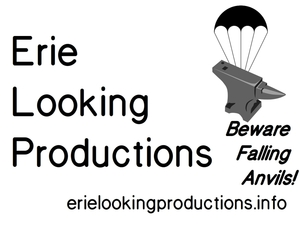
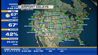
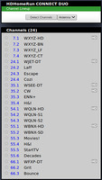
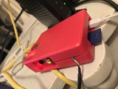

## Your Boutique Multi-Platform Media Arts Shop

Erie Looking Productions is based in Ashtabula, Ohio.  We are a boutique multi-platform media arts shop available for contract work.  From work in [LaTeX2e](https://www.latex-project.org/) to audio production to video editing, we provide unique solutions for you. Examples of audio works we have created can be found online at the [Internet Archive](https://archive.org/search.php?query=%22Erie%20Looking%20Productions%22&and[]=mediatype%3A%22audio%22).

If you're looking for the blog of Stephen Michael Kellat please head over instead to [Coyote Works](http://coyote.works/).  

## Commercial Services

We offer many services on a general commercial basis.

### Audiovisual

We handle: 

* Audio editing
* Radio ad production and placement
* Audio production
* Contract podcast production
* Limited music recording for release
* Single-camera video recording of events
* Radio airtime brokerage
* Systems analysis in conjunction with [South Shore Microphones](http://southshoremicrophones.com)

### Education

We handle:  

* Non-credit teaching using [Saylor Academy curricula](https://www.saylor.org/)  
* In-person test proctoring  

### Print
 
* Print media production using [LaTeX2e](https://www.latex-project.org/)  
* Support for churches in preparing worship materials for print and overhead display  

### Other Matters

* Referral of out-of-scope projects to other appropriate vendors as necessary
* Book collection analysis and purchasing recommendations
* Limited IT consulting to include Linux system setup

## Works in Progress

We have a variety of matters that are works in progress before us.  Those include:

* Development of a short film concerning an Internet outage in the Pacific  
* Development of a short film about all the churches in the Ashtabula area that are closing or have buildings up for sale  
* Finishing an artsy short film for the [Dam Short Film Festival](https://damshortfilm.org/) about views on perspective  
* Re-work of other short film efforts for later submission to [appropriate film festivals](https://filmfreeway.com/festivals?utf8=%E2%9C%93&config%5B%5D=call_for_entries&config%5B%5D=event_type&config%5B%5D=niches&config%5B%5D=entry_fees&config%5B%5D=years_running&config%5B%5D=runtime&config%5B%5D=submit&has_query=&q=&call_for_entries=1&ft_gold=0&ft_ff=0&ft_ff=1&ft_sc=0&ft_audio=0&ft_photo=0&ft_oe=0&project_category%5B%5D=9&fees=0%3B50&years=4%3B20&runtime=Any&inside_or_outside_country=0&countries=us&entry_deadline_when=0&entry_deadline=&event_date_when=0&event_date=&sort=event_date)  
* Development of new podcasting projects as well as development of audiovisual streaming using [OBS Studio](https://snapcraft.io/obs-studio)  
* Continued experimentation in optimal Over The Air television receiver systems design  
* Writing and review of various fictional works 

## Supporting A Vibrant Local Media Environment

A continuing research effort on our part is to look at venturing into the creation of microfilm works as well as establishing our own small press.  Our local media environment is growing darker.  We are looking for ways to keep the light of knowledge lit.  The radio landscape is also becoming less responsive to local needs which requires us to look at innovative ways to respond.  

Revival of the notion of community Wi-Fi networks may become necessary over time due to the tightening of the traditional media landscape removing much chance for new players in broadcast to emerge.  We may need to look at what can be done to interface with Wi-Fi tabletop radios and other such devices on the market.  If an apapropriate engineering plan can be developed a metro LAN to allow for a more localized sort of broadcast system may be required although the need for a Special Temporary Authority permit from the Federal Communications Commission will have to be assessed.

## Our Recent Works

### Support of Yester-Tech LLC 

We were proud to have the opportunity to support [Yester-Tech LLC](http://www.yester-tech.com/) with a custom multimedia display at a small business tradeshow on Black Friday 2019 in Eastlake, Ohio.  We deployed open source software using the [Raspbian](http://raspbian.org/) Linux distribution on a suitably configured Raspbbery Pi device in the field.  This was a rapid-deployment project for us with minimum turnaround.

*Our credit slide from the multimedia show*  

### Over The Air Reception

We have been experimenting with various styles of receiving television signals.  With the recent "channel repack" the landscape has changed a bit as to what we now can receive.  Displayed channel numbers on a television screen for Over The Air stations don't necessarily have to match the actual RF channels in use.

*An example of some Over The Air reception as seen from WSEE 35.3 ENN+ out of Erie, Pennsylvania.*

*An example of current Over The Air reception.*

This works helps us explain to clients the engineering limits of our constantly changing over-the-air television broadcast environment.

### KCRW 7th Radio Race (2019)

We had the opportunity to participate in the KCRW Radio Race which is part of the station's Independent Producer Project.  The submitted piece was entitled: "When Local Media Isn't Truly Local".  The track is [available for download from SoundCloud for listening](https://soundcloud.com/alpacaherder/radio-race-2019-when-local-media-isnt-truly-local).  We didn't win but were happy to have the chance to participate with a submission that certainly did not simply fit the mold the rest of the pack did.

*A view of the track in the SoundCloud interface.*

We look forward to next year's competition.   

### Continuing Experimentation

We do attempt to keep track of developments in the realm of microcontrollers and single board computers.  These are important items that help drive various aspects of our work.  Pictured is an original mark Raspberry Pi B that is being configured for "headless" operation.  

## To Reach Us

For more information as well as price quotes, please contact us [via Telegram](http://t.me/smkellat) or <a href="skype:stephen.michael.kellat?chat">via Skype</a>.  We can also be found on [Liberapay](https://liberapay.com/smkellat) if you wish to support us on a sustaining basis for continuing efforts.  Our rather secondary presence on Facebook can be found at <https://www.facebook.com/erielooking/> and we generally prefer to operate outside the hegemonic realm of the House of Zuckerberg.  

